# MERGED equation DAG — arxiv-1902.10565

One unified DAG across all source papers (39 nodes). One subgraph per paper; edges crossing subgraphs are shared/foundational dependencies. Collapse identical cross-paper derivations into one node (see `duplicates`). Per-node badges read project progress (see `progress`).

```mermaid
flowchart TD
  subgraph n_arxiv_1902_10565_sg["paper arxiv-1902.10565  (39 nodes)"]
    n_arxiv_1902_10565__playout_cap_randomization["● <b>playout_cap_randomization</b> · k4 t1<br/>Playout cap randomization as coded: play.cpp:1132-1150 pi… <br/><i>paper l.96-97</i>"]:::solid
    n_arxiv_1902_10565__root_explore_and_target_pruning["◐ <b>root_explore_and_target_pruning</b> · k3<br/>Forced root exploration (searchexplorehelpers.cpp:166-169… <br/><i>eq:l105, paper l.109</i>"]:::preliminary
    n_arxiv_1902_10565__loss_targets_metrics["◐ <b>loss_targets_metrics</b> · k4<br/>Loss as coded in metrics_pytorch.py:856-882: policy 0.930… <br/><i>eq:l546, eq:l550, eq:l554, eq:l558…</i>"]:::preliminary
    n_arxiv_1902_10565__score_utility_search["◐ <b>score_utility_search</b> · k3<br/>Score utility u = c * (2/pi) atan((x - x0)/(dynamicScoreC… <br/><i>eq:l689, eq:l691, eq:l702</i>"]:::preliminary
    n_arxiv_1902_10565__head_gpool_degeneracy_9x9["● <b>head_gpool_degeneracy_9x9</b> △ · k5<br/>Global pooling survives only in the policy head (KataGPoo… <br/><i>paper l.398-404</i>"]:::solid
    n_arxiv_1902_10565__train_optimizer_schedule["◐ <b>train_optimizer_schedule</b> · k4<br/>train.py defaults: SGD momentum 0.9 (opt-in AdamW/Muon/No…"]:::preliminary
    n_arxiv_1902_10565__selfplay_search_params["◐ <b>selfplay_search_params</b> · k3 t1<br/>Search/thread keys of selfplay1_maxsize9.cfg and gatekeep…"]:::preliminary
    n_arxiv_1902_10565__game_randomization_9x9["◐ <b>game_randomization_9x9</b> · k3<br/>Game-init keys in v1.18.2 selfplay cfg: bSizes/bSizeRelPr…"]:::preliminary
    n_arxiv_1902_10565__gating_rule["◐ <b>gating_rule</b> · k3<br/>Gating in v1.18.2: numGamesPerGating 200 (gatekeeper1_max…"]:::preliminary
    n_arxiv_1902_10565__train_resume_semantics["● <b>train_resume_semantics</b> · k4<br/>train.py resumes unconditionally from <traindir>/checkpoi…"]:::solid
    n_arxiv_1902_10565__data_format_pos_len["● <b>data_format_pos_len</b> · k4<br/>Training-row layout at posLen L: binaryInputNCHWPacked 22…"]:::solid
    n_arxiv_1902_10565__training_window_shuffle["◐ <b>training_window_shuffle</b> · k3<br/>shuffle.py window: -keep-target-rows (required; loop pass…"]:::preliminary
    n_arxiv_1902_10565__env_build["● <b>env_build</b> · k2 t2<br/>Toolchain on one B200 node under /scratch/schmidt/ssci-an…"]:::solid
    n_arxiv_1902_10565__cfg_9x9_override["◐ <b>cfg_9x9_override</b> · k4 t1<br/>Mission-owned codes/cfg/selfplay_9x9.cfg, codes/cfg/gatek…"]:::preliminary
    n_arxiv_1902_10565__tiny_model_export_smoke["◐ <b>tiny_model_export_smoke</b> · k4 t2<br/>Export smoke for the transformer path: codes/eval/export_…"]:::preliminary
    n_arxiv_1902_10565__synchronous_loop_smoke["◐ <b>synchronous_loop_smoke</b> · k4 t6✗4<br/>Attempt 2 (Slurm 299259, b200 gb207, 1 GPU, 24 CPUs, 05:0…"]:::preliminary
    n_arxiv_1902_10565__loop_resume_under_walltime["◐ <b>loop_resume_under_walltime</b> · k4 t20✗4<br/>Slurm wrapper codes/loop/loop.sbatch (1 GPU / 24 CPU / 12…"]:::preliminary
    n_arxiv_1902_10565__selfplay_stage["○ <b>selfplay_stage</b> · k2 t5✗1<br/>katago selfplay -max-games-total N -models-dir BASEDIR/mo…"]:::hypothesis
    n_arxiv_1902_10565__shuffle_stage["○ <b>shuffle_stage</b> · k2<br/>SKIP_VALIDATE=1 ./shuffle.sh BASEDIR TMP 8 -min-rows M -k…"]:::hypothesis
    n_arxiv_1902_10565__train_stage["○ <b>train_stage</b> · k3<br/>codes/loop/train_9x9.sh BASEDIR ktg9 b7c96h3tfrs 128 main…"]:::hypothesis
    n_arxiv_1902_10565__export_stage["○ <b>export_stage</b> · k2<br/>Mission copy of export_model_for_selfplay.sh (mv before r…"]:::hypothesis
    n_arxiv_1902_10565__gatekeeper_stage["○ <b>gatekeeper_stage</b> · k2<br/>katago gatekeeper -config gatekeeper_9x9.cfg -quit-if-no-…"]:::hypothesis
    n_arxiv_1902_10565__eval_improvement["○ <b>eval_improvement</b> △ · k2<br/>Declare 'improves under self-play at 9x9' iff (a) >= 1 ga…"]:::hypothesis
    n_arxiv_1902_10565__data_budget["○ <b>data_budget</b> · k2 t9✗5<br/>Scratch guard for the whole mission root /scratch/schmidt…"]:::hypothesis
    n_arxiv_1902_10565__scale_up["○ <b>scale_up</b> · k3<br/>Next architecture as a FRESH run (never resume a b7 check…"]:::hypothesis
    n_arxiv_1902_10565__transformer_trunk_b7c96h3tfrs["● <b>transformer_trunk_b7c96h3tfrs</b> △ · k4 t1<br/>b7c96h3tfrs (modelconfigs.py:1008-1029, registered :1887)…"]:::solid
    n_arxiv_1902_10565__engine_ffn_swiglu_constraint["● <b>engine_ffn_swiglu_constraint</b> · k1<br/>Every C++ inference backend requires useSwiGLU=1 for tran…"]:::solid
    n_arxiv_1902_10565__select_transformer_ladder["◐ <b>select_transformer_ladder</b> △ · k2<br/>Architecture ladder decision: b7c96h3tfrs (start: smoke +…"]:::preliminary
    n_arxiv_1902_10565__derive_cycle_knobs_9x9["◐ <b>derive_cycle_knobs_9x9</b> · k4 t5✗2<br/>The production cycle knobs are DERIVED from the measured …"]:::preliminary
    n_arxiv_1902_10565__verify_preemption_resume["○ <b>verify_preemption_resume</b> · k1<br/>Executed kill/resume test on the smoke BASEDIR: scancel m…"]:::hypothesis
    n_arxiv_1902_10565__loop_failure_circuit_breaker["○ <b>loop_failure_circuit_breaker</b> · k1<br/>The resubmit chain must stop on deterministic failure: sy…"]:::hypothesis
    n_arxiv_1902_10565__bootstrap_accepted_model["○ <b>bootstrap_accepted_model</b> · k1<br/>Freeze the first directory that appears in models/ (with …"]:::hypothesis
    n_arxiv_1902_10565__measure_stage_throughput["○ <b>measure_stage_throughput</b> · k1 t1<br/>Per-stage machine-readable profile on b200 (and b300 when…"]:::hypothesis
    n_arxiv_1902_10565__count_gatekeeper_acceptances["○ <b>count_gatekeeper_acceptances</b> · k1<br/>Accepted successors = (# dirs in models/) - 1 (frozen bas…"]:::hypothesis
    n_arxiv_1902_10565__match_latest_against_first["○ <b>match_latest_against_first</b> · k1<br/>katago match with codes/cfg/match_first_latest_9.cfg: 400…"]:::hypothesis
    n_arxiv_1902_10565__scale_data_window["○ <b>scale_data_window</b> · k1<br/>Raise games/cycle and the shuffle window one axis at a ti…"]:::hypothesis
    n_arxiv_1902_10565__scale_search_budget["○ <b>scale_search_budget</b> · k1<br/>Raise self-play visits maxVisits/cheapSearchVisits 128/32…"]:::hypothesis
    n_arxiv_1902_10565__async_multi_gpu_layout["□ <b>async_multi_gpu_layout</b> · k1<br/>Concurrent self-play / training on 2-4 GPUs inside one jo…"]:::future
    n_arxiv_1902_10565__converged_test_7x7["○ <b>converged_test_7x7</b> · k1 t2<br/>A converged 7x7 self-play test run with b7c96h3tfrs insid…"]:::hypothesis
  end
  n_arxiv_1902_10565__transformer_trunk_b7c96h3tfrs --> n_arxiv_1902_10565__loss_targets_metrics
  n_arxiv_1902_10565__transformer_trunk_b7c96h3tfrs --> n_arxiv_1902_10565__head_gpool_degeneracy_9x9
  n_arxiv_1902_10565__selfplay_search_params --> n_arxiv_1902_10565__cfg_9x9_override
  n_arxiv_1902_10565__game_randomization_9x9 --> n_arxiv_1902_10565__cfg_9x9_override
  n_arxiv_1902_10565__gating_rule --> n_arxiv_1902_10565__cfg_9x9_override
  n_arxiv_1902_10565__data_format_pos_len --> n_arxiv_1902_10565__cfg_9x9_override
  n_arxiv_1902_10565__env_build --> n_arxiv_1902_10565__cfg_9x9_override
  n_arxiv_1902_10565__env_build --> n_arxiv_1902_10565__tiny_model_export_smoke
  n_arxiv_1902_10565__select_transformer_ladder --> n_arxiv_1902_10565__tiny_model_export_smoke
  n_arxiv_1902_10565__cfg_9x9_override --> n_arxiv_1902_10565__synchronous_loop_smoke
  n_arxiv_1902_10565__tiny_model_export_smoke --> n_arxiv_1902_10565__synchronous_loop_smoke
  n_arxiv_1902_10565__loop_resume_under_walltime --> n_arxiv_1902_10565__synchronous_loop_smoke
  n_arxiv_1902_10565__data_budget --> n_arxiv_1902_10565__synchronous_loop_smoke
  n_arxiv_1902_10565__env_build --> n_arxiv_1902_10565__synchronous_loop_smoke
  n_arxiv_1902_10565__train_resume_semantics --> n_arxiv_1902_10565__loop_resume_under_walltime
  n_arxiv_1902_10565__env_build --> n_arxiv_1902_10565__loop_resume_under_walltime
  n_arxiv_1902_10565__playout_cap_randomization --> n_arxiv_1902_10565__selfplay_stage
  n_arxiv_1902_10565__root_explore_and_target_pruning --> n_arxiv_1902_10565__selfplay_stage
  n_arxiv_1902_10565__score_utility_search --> n_arxiv_1902_10565__selfplay_stage
  n_arxiv_1902_10565__selfplay_search_params --> n_arxiv_1902_10565__selfplay_stage
  n_arxiv_1902_10565__cfg_9x9_override --> n_arxiv_1902_10565__selfplay_stage
  n_arxiv_1902_10565__data_budget --> n_arxiv_1902_10565__selfplay_stage
  n_arxiv_1902_10565__derive_cycle_knobs_9x9 --> n_arxiv_1902_10565__selfplay_stage
  n_arxiv_1902_10565__verify_preemption_resume --> n_arxiv_1902_10565__selfplay_stage
  n_arxiv_1902_10565__loop_failure_circuit_breaker --> n_arxiv_1902_10565__selfplay_stage
  n_arxiv_1902_10565__selfplay_stage --> n_arxiv_1902_10565__shuffle_stage
  n_arxiv_1902_10565__training_window_shuffle --> n_arxiv_1902_10565__shuffle_stage
  n_arxiv_1902_10565__data_format_pos_len --> n_arxiv_1902_10565__shuffle_stage
  n_arxiv_1902_10565__shuffle_stage --> n_arxiv_1902_10565__train_stage
  n_arxiv_1902_10565__loss_targets_metrics --> n_arxiv_1902_10565__train_stage
  n_arxiv_1902_10565__select_transformer_ladder --> n_arxiv_1902_10565__train_stage
  n_arxiv_1902_10565__train_resume_semantics --> n_arxiv_1902_10565__train_stage
  n_arxiv_1902_10565__train_optimizer_schedule --> n_arxiv_1902_10565__train_stage
  n_arxiv_1902_10565__data_format_pos_len --> n_arxiv_1902_10565__train_stage
  n_arxiv_1902_10565__cfg_9x9_override --> n_arxiv_1902_10565__train_stage
  n_arxiv_1902_10565__train_stage --> n_arxiv_1902_10565__export_stage
  n_arxiv_1902_10565__tiny_model_export_smoke --> n_arxiv_1902_10565__export_stage
  n_arxiv_1902_10565__export_stage --> n_arxiv_1902_10565__gatekeeper_stage
  n_arxiv_1902_10565__gating_rule --> n_arxiv_1902_10565__gatekeeper_stage
  n_arxiv_1902_10565__cfg_9x9_override --> n_arxiv_1902_10565__gatekeeper_stage
  n_arxiv_1902_10565__count_gatekeeper_acceptances --> n_arxiv_1902_10565__eval_improvement
  n_arxiv_1902_10565__match_latest_against_first --> n_arxiv_1902_10565__eval_improvement
  n_arxiv_1902_10565__train_optimizer_schedule --> n_arxiv_1902_10565__eval_improvement
  n_arxiv_1902_10565__data_format_pos_len --> n_arxiv_1902_10565__data_budget
  n_arxiv_1902_10565__select_transformer_ladder --> n_arxiv_1902_10565__scale_up
  n_arxiv_1902_10565__head_gpool_degeneracy_9x9 --> n_arxiv_1902_10565__scale_up
  n_arxiv_1902_10565__data_budget --> n_arxiv_1902_10565__scale_up
  n_arxiv_1902_10565__eval_improvement --> n_arxiv_1902_10565__scale_up
  n_arxiv_1902_10565__scale_search_budget --> n_arxiv_1902_10565__scale_up
  n_arxiv_1902_10565__measure_stage_throughput --> n_arxiv_1902_10565__scale_up
  n_arxiv_1902_10565__transformer_trunk_b7c96h3tfrs --> n_arxiv_1902_10565__select_transformer_ladder
  n_arxiv_1902_10565__engine_ffn_swiglu_constraint --> n_arxiv_1902_10565__select_transformer_ladder
  n_arxiv_1902_10565__train_resume_semantics --> n_arxiv_1902_10565__derive_cycle_knobs_9x9
  n_arxiv_1902_10565__data_format_pos_len --> n_arxiv_1902_10565__derive_cycle_knobs_9x9
  n_arxiv_1902_10565__training_window_shuffle --> n_arxiv_1902_10565__derive_cycle_knobs_9x9
  n_arxiv_1902_10565__synchronous_loop_smoke --> n_arxiv_1902_10565__derive_cycle_knobs_9x9
  n_arxiv_1902_10565__train_resume_semantics --> n_arxiv_1902_10565__verify_preemption_resume
  n_arxiv_1902_10565__synchronous_loop_smoke --> n_arxiv_1902_10565__verify_preemption_resume
  n_arxiv_1902_10565__loop_resume_under_walltime --> n_arxiv_1902_10565__loop_failure_circuit_breaker
  n_arxiv_1902_10565__synchronous_loop_smoke --> n_arxiv_1902_10565__loop_failure_circuit_breaker
  n_arxiv_1902_10565__gating_rule --> n_arxiv_1902_10565__bootstrap_accepted_model
  n_arxiv_1902_10565__export_stage --> n_arxiv_1902_10565__bootstrap_accepted_model
  n_arxiv_1902_10565__gatekeeper_stage --> n_arxiv_1902_10565__bootstrap_accepted_model
  n_arxiv_1902_10565__gatekeeper_stage --> n_arxiv_1902_10565__measure_stage_throughput
  n_arxiv_1902_10565__verify_preemption_resume --> n_arxiv_1902_10565__measure_stage_throughput
  n_arxiv_1902_10565__gatekeeper_stage --> n_arxiv_1902_10565__count_gatekeeper_acceptances
  n_arxiv_1902_10565__bootstrap_accepted_model --> n_arxiv_1902_10565__count_gatekeeper_acceptances
  n_arxiv_1902_10565__bootstrap_accepted_model --> n_arxiv_1902_10565__match_latest_against_first
  n_arxiv_1902_10565__count_gatekeeper_acceptances --> n_arxiv_1902_10565__match_latest_against_first
  n_arxiv_1902_10565__derive_cycle_knobs_9x9 --> n_arxiv_1902_10565__scale_data_window
  n_arxiv_1902_10565__measure_stage_throughput --> n_arxiv_1902_10565__scale_data_window
  n_arxiv_1902_10565__data_budget --> n_arxiv_1902_10565__scale_data_window
  n_arxiv_1902_10565__scale_data_window --> n_arxiv_1902_10565__scale_search_budget
  n_arxiv_1902_10565__measure_stage_throughput --> n_arxiv_1902_10565__async_multi_gpu_layout
  n_arxiv_1902_10565__scale_up --> n_arxiv_1902_10565__async_multi_gpu_layout
  n_arxiv_1902_10565__env_build --> n_arxiv_1902_10565__converged_test_7x7
  n_arxiv_1902_10565__cfg_9x9_override --> n_arxiv_1902_10565__converged_test_7x7
  n_arxiv_1902_10565__synchronous_loop_smoke --> n_arxiv_1902_10565__converged_test_7x7
  classDef solid fill:#e6ffed,stroke:#28a745,color:#000;
  classDef preliminary fill:#fff8e1,stroke:#d4a017,color:#000;
  classDef hypothesis fill:#e7f0ff,stroke:#4977c7,color:#000;
  classDef blocking fill:#ffe3e3,stroke:#d33,color:#000;
  classDef future fill:#f2f2f2,stroke:#999,color:#555;
  classDef amended fill:#f0f0f0,stroke:#aaa,color:#888;
```

Legend: ● solid · ◐ preliminary · ○ hypothesis · ✗ blocking · □ future · △ concept-advance. Node badge `k<N>` = knowledge records under the node, `t<N>✗<F>` = trials (F failed). Dashed edge = predecessor outside scope.

