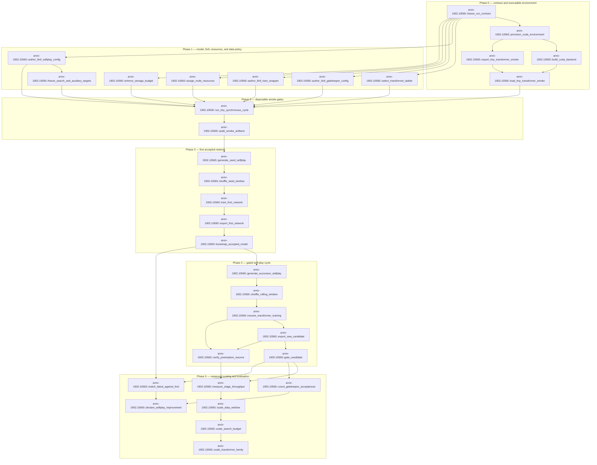

# Dependency logic: 9x9 transformer-trunk KataGo

The paper identifier is only a namespace. Nodes below follow the v1.18.2 implementation; the 2019 paper supplies names only for ideas still present in current code. `[OPEN]` marks a proposed parameter, cluster assumption, resource estimate, or success threshold that must be measured. Unless a different root is written explicitly, every shortened code anchor resolves below `ref-code/lightvector-KataGo/`.

| node_id | one-line summary | predecessors | evidence type (admission-contract vocabulary) | concrete verification command or measurable criterion | risk tier R0-R4 | claim tag |
|---|---|---|---|---|---|---|
| `arxiv-1902.10565::freeze_run_contract` | Freeze one-node Slurm limits (≤4 GPUs, ≤24 CPUs/job, ≤72 h), b300→b200 placement, and a run-local path manifest; `[OPEN]` partition/module availability is a cluster fact. The loop itself accepts one base directory and one scratch directory (`python/selfplay/synchronous_loop.sh:12-45`). | — | literature grounding | `scontrol show job "$SLURM_JOB_ID"` must report one node, `NumCPUs<=24`, `TresPerNode` with at most four GPUs, and `TimeLimit<=3-00:00:00`; record `mission.json:26-36`. | R1 | [PRELIMINARY] |
| `arxiv-1902.10565::provision_cuda_environment` | Create a run-local Python environment with CUDA 12.8, `torch==2.11.0+cu128`, and pip `nvidia-cudnn-cu12>=9.8`; the engine requires CUDA 11+ and a compatible cuDNN (`ref-code/lightvector-KataGo/Compiling.md:31-40`). | freeze_run_contract | unchecked external step | `python -c 'import torch; assert torch.__version__=="2.11.0+cu128"; assert torch.version.cuda=="12.8"; assert torch.cuda.is_available(); assert torch.backends.cudnn.version()>=90800'`; also `nvcc --version`. `[OPEN]` discover the site module name before submission. | R2 | [HYPOTHESIS] |
| `arxiv-1902.10565::build_cuda_backend` | Configure an out-of-tree CUDA build, pointing CMake explicitly at the wheel's cuDNN include and library; CMake searches `CUDNN_ROOT_DIR`, the CUDA includes, and `cudnn` (`ref-code/lightvector-KataGo/cpp/CMakeLists.txt:1120-1143`). | provision_cuda_environment | unchecked external step | `cmake -S ref-code/lightvector-KataGo/cpp -B "$RUN/build" -DUSE_BACKEND=CUDA -DUSE_TCMALLOC=1 -DNO_GIT_REVISION=1 -DCUDNN_INCLUDE_DIR="$CUDNN_DIR/include" -DCUDNN_LIBRARY="$CUDNN_DIR/lib/libcudnn.so.9" && cmake --build "$RUN/build" -j 16`; criterion: executable `katago` exits 0 for `version`. | R2 | [HYPOTHESIS] |
| `arxiv-1902.10565::export_tiny_transformer_smoke` | Export a randomly initialized `b5c48h3tfr` before training, using the current PyTorch exporter flags (`python/export_model_pytorch.py:33-43,57-60,78-87,119-123`). | provision_cuda_environment | numerical simulation | From `ref-code/lightvector-KataGo/python`: `python export_model_pytorch.py -export-random-initialized-model b5c48h3tfr -export-dir "$SMOKE/export" -model-name ktg9-smoke -filename-prefix model`; criterion: nonempty `model.bin`. | R1 | [PRELIMINARY] |
| `arxiv-1902.10565::load_tiny_transformer_smoke` | Prove the C++ v1.18.2 descriptor parser can load the exported transformer/FFN blocks (`cpp/neuralnet/desc.cpp:1480-1557`; benchmark flags at `cpp/command/benchmarknn.cpp:49-92`). | build_cuda_backend, export_tiny_transformer_smoke | numerical simulation | `"$RUN/build/katago" benchmarknn -model "$SMOKE/export/model.bin" -config "$CFG/benchmark9.cfg" -boardsize 9 -require-exact-nnlen -batch-size 2 -warmup 1 -iterations 2 -json`; criterion: valid JSON, CUDA backend, no unknown-block or shape error. | R2 | [HYPOTHESIS] |
| `arxiv-1902.10565::select_transformer_ladder` | Start with the smallest registered transformer, `b5c48h3tfr` (5 blocks, 48 channels, 3 heads, 128-channel FFN), then test b7/b8 and only later b14 as separate runs (`python/katago/train/modelconfigs.py:986-1077,1873-1898`; implementation at `python/katago/train/model_pytorch.py:2079-2129,2502-2536,3231-3285`). | freeze_run_contract | literature grounding | `python -c 'from katago.train.modelconfigs import config_of_name; print(config_of_name["b5c48h3tfr"])'` from `ref-code/lightvector-KataGo/python`; criterion: version 17, 5 `attnrope`+`ffng` pairs, trunk 48, heads 3. | R0 | [SOLID] |
| `arxiv-1902.10565::author_9x9_selfplay_config` | Copy `selfplay1_maxsize9.cfg` into mission scope and force `dataBoardLen=9`, `bSizes=9`, `bSizeRelProbs=1`, `allowRectangleProb=0`; upstream otherwise mixes 7/8/9 and allocates 19 (`cpp/configs/training/selfplay1_maxsize9.cfg:11-19,84-116`). | freeze_run_contract | exact proof | Parse the effective file and assert exactly those four key/value pairs; run a 20-game smoke and assert every SGF root has `SZ[9]`. | R2 | [HYPOTHESIS] |
| `arxiv-1902.10565::author_9x9_gatekeeper_config` | Copy `gatekeeper1_maxsize9.cfg`, force only 9x9, and retain symmetric 200-game, 150-visit gating (`cpp/configs/training/gatekeeper1_maxsize9.cfg:18-20,38-50`). | freeze_run_contract | exact proof | Assert `bSizes=9`, `bSizeRelProbs=1`, `allowRectangleProb=0`, `numGamesPerGating=200`, `maxVisits=150`; after a gate, assert all emitted SGFs contain `SZ[9]`. | R2 | [HYPOTHESIS] |
| `arxiv-1902.10565::author_9x9_train_wrapper` | Make a mission-owned `train.sh` copy whose mandatory positional length is 9, because upstream hard-codes 19 (`python/selfplay/train.sh:83-93`) while `train.py` accepts `-pos-len` (`python/train.py:69-86`). | freeze_run_contract | exact proof | `rg -n -- '-pos-len 9' "$RUN/scripts/train9.sh"` returns one invocation and `rg -n -- '-pos-len 19' "$RUN/scripts/train9.sh"` returns none; first checkpoint reports `pos_len=9`. | R2 | [HYPOTHESIS] |
| `arxiv-1902.10565::freeze_search_and_auxiliary_targets` | Keep code-current Playout Cap Randomization, forced root playouts, policy-target pruning, and auxiliary heads fixed while scaling compute: baseline `.75/100/600`, coefficient 2, pruning enabled, soft-policy scale 8, and value/TD/ownership/score targets (`selfplay1_maxsize9.cfg:60-78,115-149`; `cpp/search/searchexplorehelpers.cpp:165-169`; `cpp/search/searchupdatehelpers.cpp:495-538`; `python/train.py:140-152`; head outputs at `python/katago/train/model_pytorch.py:2610-2768,4101-4149`; loss composition at `python/katago/train/metrics_pytorch.py:531-608,735-882`). | author_9x9_selfplay_config | literature grounding | Config audit plus training log: required keys exist; per-head losses are finite; `noisePruneUtilityScale=0.15` and `useNoisePruning=true` are explicit rather than inherited (`cpp/program/setup.cpp:576-584`). | R2 | [PRELIMINARY] |
| `arxiv-1902.10565::assign_node_resources` | Use a smoke/pilot temporal split on 2 GPUs and ≤24 CPUs; `[OPEN]` permit a measured 4-GPU steady-state split of 3 self-play GPUs/1 training GPU only if it beats synchronous utilization. Upstream intentionally uses game concurrency for batching (`SelfplayTraining.md:43-49`). | freeze_run_contract | controlled approximation | At runtime sample `sstat`, `nvidia-smi dmon`, and process thread counts; criterion: allocated GPUs≤4, CPU allocation≤24, no oversubscription, and every intended GPU has nonzero utilization. | R3 | [HYPOTHESIS] |
| `arxiv-1902.10565::enforce_storage_budget` | Cap the mission at 200 GiB, stop new cycles at 180 GiB, and reserve 20 GiB for checkpoint/export recovery; `[OPEN]` this is a conservative allocation from about 2.4 TB nominal free. The shuffler's estimator is explicitly 19x19-only (`python/shuffle.py:33-50,459-480,762-790`). | freeze_run_contract | dimensional consistency | Before and after every stage record `du -sb "$RUN"` and `df -B1 "$RUN"`; hard criterion: run bytes≤214748364800 and pre-cycle bytes≤193273528320. Compare real 9x9 bytes/row with the estimate after 100k rows. | R3 | [HYPOTHESIS] |
| `arxiv-1902.10565::run_tiny_synchronous_cycle` | Run one finite, disposable 9x9 cycle in exact gatekeeper→selfplay→shuffle→train→export order, with 4 games, 8 visits, batch 8, min rows 1, keep rows 256, 64 samples/epoch/SWA, and ≤128 train samples `[OPEN]`; replace the upstream infinite `while true` with a one-cycle mission wrapper (`python/selfplay/synchronous_loop.sh:91-116`). | load_tiny_transformer_smoke, select_transformer_ladder, author_9x9_selfplay_config, author_9x9_gatekeeper_config, author_9x9_train_wrapper, freeze_search_and_auxiliary_targets, assign_node_resources, enforce_storage_budget | numerical simulation | Submit one ≤30-minute job; criterion: all five stage exit codes are 0, no NaN/OOM, at least one self-play NPZ, one shuffled NPZ, one checkpoint, and one exported model. The wrapper must not execute the archival VCS commands at `synchronous_loop.sh:73-86`. | R3 | [HYPOTHESIS] |
| `arxiv-1902.10565::audit_smoke_artifacts` | Validate the tiny cycle's shapes and lineage rather than strength: 9x9 tensors, parsable checkpoint, exported model load, and only `SZ[9]` games (`python/shuffle.py:52-69`; `python/train.py:573-623`; `python/export_model_pytorch.py:682-700`). | run_tiny_synchronous_cycle | empirical measurement | Load one raw and shuffled NPZ, assert spatial length 81 and policy length 82; load checkpoint on CPU; run the two-iteration `benchmarknn` check on the cycle's `model.bin.gz`; scan all smoke SGFs for only `SZ[9]`. | R2 | [HYPOTHESIS] |
| `arxiv-1902.10565::generate_seed_selfplay` | With an empty accepted-model directory, generate the initial random-play dataset using exact `katago selfplay -max-games-total … -output-dir … -models-dir … -config …` (`python/selfplay/synchronous_loop.sh:98-99`; empty-model startup described at `SelfplayTraining.md:43-49`). | audit_smoke_artifacts | numerical simulation | Start `[OPEN]` with 500 games and pilot visits 128/cheap visits 32; criterion: command exits 0, summary row count reaches ≥50k or records the shortfall, and every SGF is 9x9. | R3 | [HYPOTHESIS] |
| `arxiv-1902.10565::shuffle_seed_window` | Materialize the first bounded data window with the v1.18.2 wrapper and its exact dynamic-window flags; omit Q targets for this non-Q model to reduce output (`python/selfplay/shuffle.sh:39-54`; `python/shuffle.py:777-801`). | generate_seed_selfplay | numerical simulation | `SKIP_VALIDATE=1 ./shuffle.sh "$RUN" "$SHUFFLE_TMP" 8 -min-rows 50000 -keep-target-rows 300000 -taper-window-scale 50000 -exclude-qvalues`; criterion: atomic final directory plus JSON row range (`python/shuffle.py:1330-1335`). `[OPEN]` raise games if min rows is not met. | R3 | [HYPOTHESIS] |
| `arxiv-1902.10565::train_first_network` | Train `b5c48h3tfr` at pos_len 9 with bounded epochs/data reuse, bf16, and 2-GPU DDP only after memory smoke (`python/train.py:79-130,434-443,479-496,1422-1452`). | shuffle_seed_window | numerical simulation | `./train9.sh "$RUN" ktg9_b5 b5c48h3tfr "$BATCH" main -multi-gpus 0,1 -use-bf16 -samples-per-epoch 50000 -swa-period-samples 40000 -epochs-per-export 4 -no-repeat-files -quit-if-no-data -stop-when-train-bucket-limited -max-train-bucket-per-new-data 4 -max-train-bucket-size 200000 -max-epochs-this-instance 4`; criterion: finite losses, a checkpoint, and exactly one export-ready checkpoint. `[OPEN]` choose the largest tested batch without OOM. | R3 | [HYPOTHESIS] |
| `arxiv-1902.10565::export_first_network` | Export SWA weights with the current exporter invocation, not the stale historical exporter name (`python/selfplay/export_model_for_selfplay.sh:77-90`; `python/export_model_pytorch.py:33-43`). | train_first_network | numerical simulation | `./export_model_for_selfplay.sh ktg9 "$RUN" 0`; criterion: exactly one new directory under `models/`, containing loadable `model.bin.gz`, and exporter log says `Done exporting:`. | R2 | [HYPOTHESIS] |
| `arxiv-1902.10565::bootstrap_accepted_model` | Treat the first exported network as the fixed baseline and accepted seed; gatekeeper requires at least one existing accepted model before candidates can be tested (`cpp/command/gatekeeper.cpp:394-427`). | export_first_network | exact proof | Record immutable baseline model name and SHA-256 in the run manifest; criterion: `models/` has exactly the baseline and `modelstobetested/` is empty before enabling gating. | R2 | [HYPOTHESIS] |
| `arxiv-1902.10565::generate_successor_selfplay` | Generate later data from the current accepted model using the same exact self-play CLI and strict 9x9/search config (`python/selfplay/synchronous_loop.sh:98-99`; `cpp/configs/training/selfplay1_maxsize9.cfg:84-149`). | bootstrap_accepted_model | numerical simulation | Per cycle, exact command from the script with `[OPEN]` 500→2000 games; criterion: model name in logs equals current accepted model, rows increase monotonically, `SZ[9]` only, and no invalid/aborted-game spike. | R3 | [HYPOTHESIS] |
| `arxiv-1902.10565::shuffle_rolling_window` | Recompute a sublinearly growing recent-data window using `expand=0.4`, exponent `0.65`, configurable scale, and a retained sample larger than that cycle's train cap (`python/selfplay/shuffle.sh:39-54`; `python/shuffle.py:414-435,718-747`). | generate_successor_selfplay | numerical simulation | `SKIP_VALIDATE=1 ./shuffle.sh "$RUN" "$SHUFFLE_TMP" 8 -min-rows 100000 -keep-target-rows 600000 -taper-window-scale 50000 -exclude-qvalues`; criterion: JSON row range advances and retained rows≥the 500k train cap. | R3 | [PRELIMINARY] |
| `arxiv-1902.10565::resume_transformer_training` | Continue the same b5 run from `checkpoint.ckpt`, preserving optimizer/SWA/global sample state and bounding each Slurm instance (`python/train.py:573-623,779-796,943-982,1185-1281`). | shuffle_rolling_window | numerical simulation | Re-run `train9.sh` with the same model kind/pos_len and bounded flags; criterion: first logged global sample count equals the prior checkpoint, then rises, and no file repeats when `-no-repeat-files` is set. | R3 | [HYPOTHESIS] |
| `arxiv-1902.10565::export_swa_candidate` | Export the resumed SWA checkpoint into `modelstobetested/` by invoking the current helper with gating enabled (`python/selfplay/export_model_for_selfplay.sh:42-58,77-90,115-121`). | resume_transformer_training | numerical simulation | `./export_model_for_selfplay.sh ktg9 "$RUN" 1`; criterion: one uniquely named loadable candidate appears only in `modelstobetested/`, with sample/row metadata matching the checkpoint. | R2 | [HYPOTHESIS] |
| `arxiv-1902.10565::gate_candidate` | Run the exact v1.18.2 gatekeeper CLI; a candidate passes when its score reaches `requiredCandidateWinProp*numGames`, with ties scored for the candidate (`python/selfplay/synchronous_loop.sh:95-96`; `cpp/command/gatekeeper.cpp:247-306,579-630`). | export_swa_candidate | empirical measurement | `katago gatekeeper -rejected-models-dir "$RUN/rejectedmodels" -accepted-models-dir "$RUN/models" -sgf-output-dir "$RUN/gatekeepersgf" -test-models-dir "$RUN/modelstobetested" -config "$CFG/gatekeeper9.cfg" -quit-if-no-nets-to-test`; criterion: candidate moved atomically to accepted or rejected and 200 `SZ[9]` games are attributable. | R4 | [HYPOTHESIS] |
| `arxiv-1902.10565::verify_preemption_resume` | Demonstrate walltime-safe restart from atomic current/previous checkpoints and a fresh shuffle directory; train saves atomically and makes 12-hour long-term checkpoints (`python/train.py:579-623,1827-1889`; pause/resume guidance `SelfplayTraining.md:80`). | resume_transformer_training, export_swa_candidate | empirical measurement | In smoke only, send `SIGINT`, resubmit the same base directory, and compare checkpoint global samples/SWA count before and after; criterion: no regression, corrupt load, duplicate export, or `.tmp` directory selected. | R3 | [HYPOTHESIS] |
| `arxiv-1902.10565::measure_stage_throughput` | Measure games/hour, rows/hour, shuffled rows/hour, train samples/s, GPU utilization, peak VRAM/RAM, and bytes/row on both eligible node types before scaling `[OPEN]` (`SelfplayTraining.md:25-32`; raw NN benchmark JSON is defined at `cpp/command/benchmarknn.cpp:49-92,186`). | gate_candidate, verify_preemption_resume | empirical measurement | Emit one JSON record per stage and hardware type; criterion: ≥30 minutes steady-state or one complete pilot cycle, with elapsed time and resource maxima, and no extrapolated cycle exceeding 60 h (12 h safety reserve). | R2 | [HYPOTHESIS] |
| `arxiv-1902.10565::scale_data_window` | Increase games/cycle and training window only while measured reuse≤4, kept rows exceed the train cap, and the 180-GiB start guard passes; `[OPEN]` initial 100k/600k/500k settings come from the small loop (`python/selfplay/synchronous_loop.sh:57-66`). | measure_stage_throughput | controlled approximation | For each change, require two artifact-complete cycles, `train_bucket_used/new_rows<=4`, no-data wait below 10% walltime, and measured projected peak disk<180 GiB. | R3 | [HYPOTHESIS] |
| `arxiv-1902.10565::scale_search_budget` | Raise pilot `maxVisits/cheapSearchVisits` 128/32→300/64→the preset 600/100 without changing forced-playout or pruning coefficients `[OPEN]` (`cpp/configs/training/selfplay1_maxsize9.cfg:60-68,115-149`). | scale_data_window | controlled approximation | Advance only if projected cycle≤60 h, GPU duty cycle≥70%, and at least one of gate score or fixed-budget baseline Elo does not regress; record games/hour at each step. | R4 | [HYPOTHESIS] |
| `arxiv-1902.10565::scale_transformer_family` | After b5 closes an end-to-end gated run, start fresh, isolated b7 then b8 and optionally b14 transformer runs; architecture changes are not checkpoint resumes (`python/katago/train/modelconfigs.py:1008-1077,1885-1898`). | scale_search_budget | conjecture | `[OPEN]` admit the next model only if export/load smoke passes, tested batch fits with ≥10% VRAM headroom, projected cycle≤60 h, and measured accepted-Elo gain per GPU-hour beats b5; never load a b5 checkpoint into another config. | R4 | [HYPOTHESIS] |
| `arxiv-1902.10565::count_gatekeeper_acceptances` | Count operational improvement as accepted successors beyond the immutable first net, independently reconciling directory state and the gatekeeper's `Candidate won match` decisions (`cpp/command/gatekeeper.cpp:579-630`). | gate_candidate | empirical measurement | `find "$RUN/models" -mindepth 1 -maxdepth 1 -type d \| wc -l` minus one must equal parsed accepted decisions and be ≥1; report attempts, accepts, rejects, and acceptance fraction. | R3 | [HYPOTHESIS] |
| `arxiv-1902.10565::match_latest_against_first` | Run a fixed 400-game `[OPEN]` 9x9 match between the latest accepted net and the frozen first net, with colors balanced and identical 150-visit settings (`cpp/configs/match_example.cfg:1-15,33-73,79-111`; `docs/releasepackaging/README.txt:71-73`). | bootstrap_accepted_model, gate_candidate | statistical inference | `katago match -config "$CFG/match_first_latest_9.cfg" -log-file "$EVAL/match.log" -sgf-output-dir "$EVAL/sgfs"`; compute score `p=(W+0.5D)/N` and `Elo=400*log10(p/(1-p))`; report W/L/D, point Elo, and a 95% interval. | R4 | [HYPOTHESIS] |
| `arxiv-1902.10565::declare_selfplay_improvement` | Declare measurable improvement only when ≥1 successor was gate-accepted and latest-vs-first Elo is positive; call it statistically supported only if the 95% interval excludes 0 `[OPEN]`. | count_gatekeeper_acceptances, match_latest_against_first | statistical inference | Required report fields: baseline/latest hashes, accepted successor count, W/L/D/N, Elo and 95% interval, visits/game, board-size audit, hardware, and total GPU-hours. If either required metric fails, conclusion is “not demonstrated.” | R4 | [HYPOTHESIS] |
